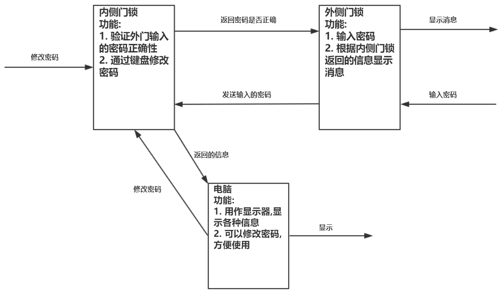
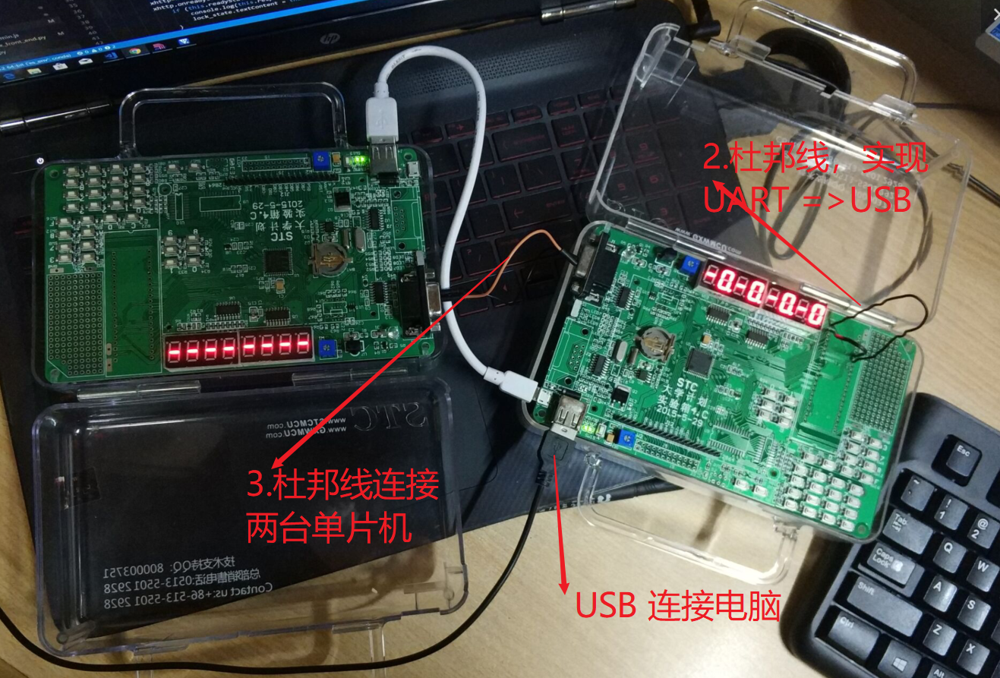
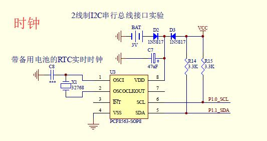
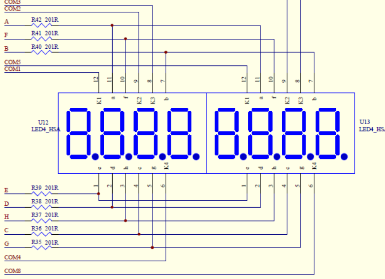
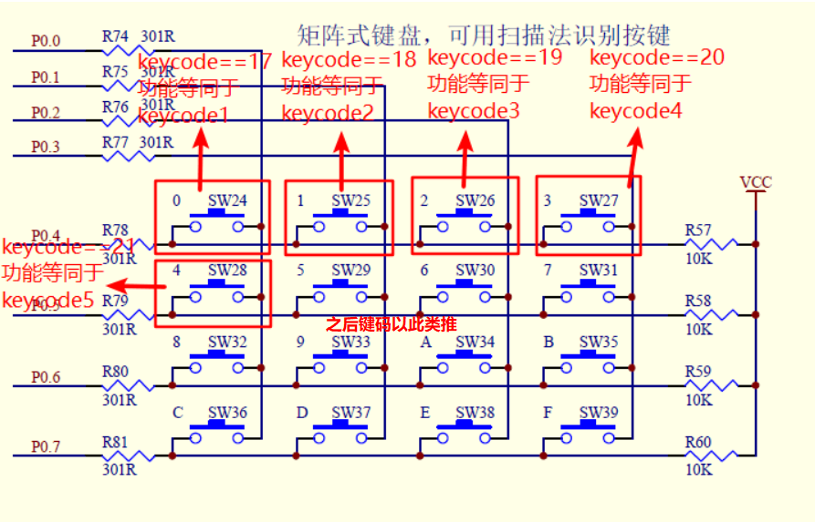
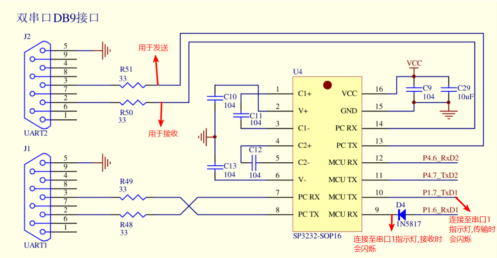
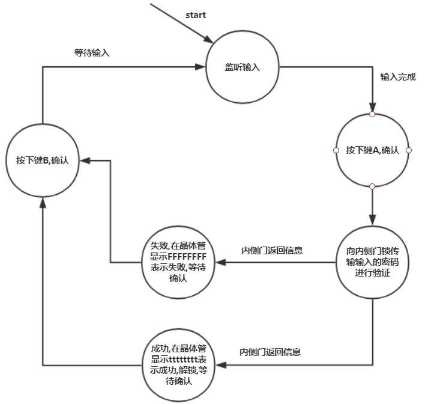
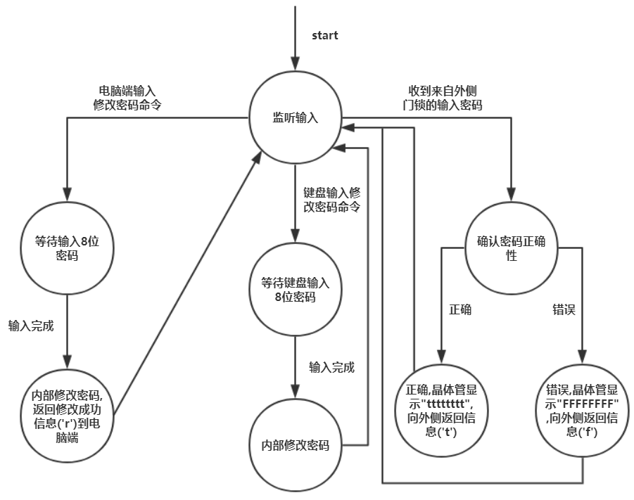
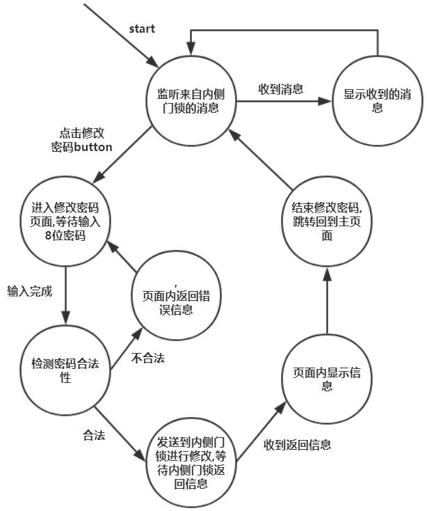
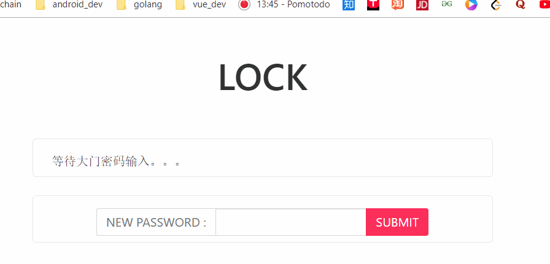

[TOC]

## 基于单片机的通信实验报告

### 0.如何运行

测试环境：win10 + python 3.6 + chrome 

- 按照硬件连接图完成连接
- 安装对应的python模块(pyserial)。
- 运行代码目录中的 simpe_render\simple_lock_front_end.py
- 打开chrome浏览器输入 `localhost:9000` 。【9000为默认端口，可以自行在源文件中修改】

### 1. 连接图

#### 1.1 逻辑连接图



####  1.2 实际硬件连接图



- 由于器材有限，杜邦线3，是在宿舍中DIY制作而成的。

### 2. 原理图

#### 2.1 RTC

RTC 也即 `real time clock`实时时钟，主要用于为操作系统提供可靠的时间；当系统处于断电 的情况下，RTC记录操作系统时间，并可在电池供电情况下继续正常工作，当系统正常启动后，系统可从RTC读取时间信息，来确保断电后时间运行连续性。在实验中用于计时。

##### 2.1.1 本实验RTC原理图



#### 2.2 晶体管

晶体管所显示的数字是根据时钟的频率扫描显示的，当我们把时钟的扫描频率提高到人眼难以识别的时候，就能达成同时显示多个数码管的效果，那么我们就可以成功的将数据成功的显示到晶体管上。

##### 2.2.1 本实验晶体管原理图



#### 2.3 矩阵按键

独立键盘检测，在单片机外围电路中  ，通常用到的按键都是机械弹性开关，当开关闭合时，线路导通，开关断开时，线路断开。单片机检测按键的原理：按键的一端接地，另一端与单片机的某个I/O口相连，开始先给I/O赋一高电平，然后让单片机不断检测该I/O口是否变为低电平，当按键闭合时，相当于I/O口与地相连，就会变为低电平。在单片机检测按键是否被按下时，电压的实际波形与理想波形时有一点=定差别的，波形在按下和释放瞬间都有抖动现象，抖动时间的长短和按键的机械特性有关 。所以单片机在检测键盘是否被按下都要加上去抖操作，所以在编写单片机的键盘检测程序时，一般在检测按下时加入去抖延时。独立键盘与单片机连接时每一个按键都需要一个I/O口，会过多占用I/O口资源。

与独立键盘不同，矩阵键盘的连接方式，每一行将每个按键的一端连接在一起构成行线，每一列将按键的另一端连接在一起构成列线。这样的话，16个按键排成4行4列就只要8根线。它的按键检测，简单点说，就是先送一列低电平，其余均为高电平，然后轮流检测，确认行列。

##### 2.3.1 本实验矩阵按键原理图



#### 2.4 端口控制

该实验使用了单片机的`UART端口2`和`UART端口3`完成了通信操作。




### 3. 程序流程图

#### 3.1 外侧门锁



#### 3.2 内侧锁控制器



#### 3.3 电脑端



### 4. 功能说明

实现了以下的功能：

- 两个单片机之间密码的传输，
  - 外部的锁接受密码的输入，把输入交由内部电脑判断，内部锁控制器判断，并将结果放回。
- 单片机与电脑之间的串口通信
  - 电脑可以追踪记录门锁被尝试解开的时间和正确情况。（将每次的输入情况【时间和正确情况】保存起来)
  - 可以远程更改门锁的密码。

### 5. 实验分析

#### 5.1 通用功能

- 按键信息的接收：按键信息的模块的代码的编写都是直接引用了样例代码中的内容，原理分析可以查看，上面2.3矩阵按键的内容。
- 利用内部时钟：利用了Timer1 作为 URAT 的波特率计算的来源。值得一提的是，经过实验验证在本实验的单片机上使用波特率应该是9600。
- 单片机通信: 沿用了上次实验的的中断收发。
- 单片机与电脑通信: 通过杜邦线的连接,将通过URAT串口输出的信息同时输出到USB口，实现和电脑之间的连接。
- 单片机的显示：使用单片机的八段晶体管展示对应相应的情况。

- 通信方式：通信采用的是中断收发的方式。中断收发使用的单片机内部提供的4号中断 UART 中断服务，也就是` interrupt UART1_VECTOR` 大概来说，在每次缓冲区满的时候就会出发这个中断，在这个中断里面实现数据的操作。

  ```c
  void UART1_int (void) interrupt 4
  {
      if(RI)
      {
          RI = 0;
          RX1_Buffer[RX1_Cnt] = SBUF;
          if(++RX1_Cnt >= UART1_BUF_LENGTH)   RX1_Cnt = 0;    //防溢出
      }
  
      if(TI)
      {
          TI = 0;
          B_TX1_Busy = 0;
      }
  }
  ```

#### 5.2外侧门锁
程序的大致流程如3.1 所示，下面只是展示一些细节

- 密码输入的回显。
  - 使用状态机，一旦用户按到键盘进入键盘，进入密码输入模式，用户每按下一个数字，都会显示到单片机的晶体管上。
- 密码输入之后的反馈。
  - 密码输入之后，发送到内部控制器进行验证，验证之后把结果通过UART

#### 5.3 内侧锁控制器

程序大致流程如3.2所示，部分细节如下

- 密码更改模式：
  - 进入密码更改模式只能通过向控制器传入特定信息进行触发，这个信息，无法通过外部的锁传进锁控制器，换句话说外部锁能传给内部锁的信息是固定的，不可能出发密码更改模式。
  - 进入更改模式之后，可以通过两种方式来修改密码
    - 通过电脑输入传输新的密码到内部锁控制器实现密码的更改
    - 通过内部锁控制器的按键进行密密码更改。

#### 5.4 电脑端

- 电脑端由于采用的是C/S方式来实现前端的展现（水平和时间有限，实现很粗糙），同时只是把记录文件简单写入文件中。

- 服务端运行两个线程

  - 一个线程搭建一个简单的服务器，监听来自浏览器前端的输入，根据前端的输入，向单片机发送相应的内容。

  - ```python
    if __name__ == '__main__':
        server_class = HTTPServer
        httpd = server_class((HOST_NAME, PORT_NUMBER), MyHandler)
        print(time.asctime(), 'Server Starts - %s:%s' % (HOST_NAME, PORT_NUMBER))
        try:
            httpd.serve_forever()
        except KeyboardInterrupt:
            pass
        httpd.server_close()
        print(time.asctime(), 'Server Stops - %s:%s' % (HOST_NAME, PORT_NUMBER)
    ```

  - 另一个线程利用 `pyserial` 监听来自单片机的输入，根据单片机的反馈情况，完成对应的状态转化。同时把记录写进文件中，用于日后查询。

  - ```python
    def receiver(ser):
        # setup logger
        logger = logging.getLogger('simple_lock')
        logger.setLevel(logging.INFO)
        fh = logging.FileHandler('record.log', encoding='utf-8')
        fh.setLevel(logging.INFO)
        formatter = logging.Formatter('%(asctime)s - %(name)s - %(levelname)s - %(message)s')
        fh.setFormatter(formatter)
        logger.addHandler(fh)
    
        buffer = ''
        global state
        # state = STATE_PASSWORD_INVALID
        while 1:
            s = ser.read(1)
            if s:
                c = s.decode('utf-8')
                # Notice: when restarting SCM, the first char is char(0).
                # In Windows, if the first char of string is char(0),
                #   the string won't be printed.
                if ord(c) != 0:
                    # print(c)
                    buffer += c
            else:
                if buffer:
                    print("getting feed back from outer part of lock")
                    print(buffer)
                    if buffer == 'r':
                        state = STATE_PASSWORD_RETTING_SUCCESSFULLY                     
                    elif buffer == 'f':
                        state = STATE_PASSWORD_INVALID
                    elif buffer == 't':
                        state = STATE_PASSWORD_VALID
                    logger.info(state)
                    time.sleep(5)
                    state = STATE_WAITING_INPUT
                buffer = ''
    ```

- 客户端（前端）显示简单的界面，实现和用户的交互

  - 输出当前门锁的状态（处于简单和用户体验【不用手动刷新浏览器】考虑，通过客户端向服务端轮询来实现状态转化）

  - ```js
      const timeId = setInterval(() => {
        // ask server the state of the lock 
        var xhttp;
        xhttp = new XMLHttpRequest();
        xhttp.onreadystatechange = function () {
          if (this.readyState == 4 && this.status == 200) {
            // console.log(this.responseText)
            lock_state.textContent = this.responseText
          }
          // else if (this.status != 200){
          //     poll__fail_times ++
          //     if(poll__fail_times >= 10) {
          //         console.log("falied too much time, cancel timer automatically!")
          //         clearInterval(timeId)
          //     }
          // }
        };
        xhttp.open("GET", "poll", true);
        xhttp.send();
      }, 1000);
      ```
    ```
  
  - 实现锁密码的远程更改功能，用户输入新的密码，前端发往服务端，服务端再发往单片机实现密码的更改。
    ```

### 6. 程序运行(.gif)

- 密码输入错误


- 密码输入正确

  

- 更改密码

  

### 7. 目录结构以及源码

**(注：具体代码在压缩包中)**

> C:.
> │  report.md  // 实验报告
> ├─pic  // 实验报告使用的图片
> └─third_proj
> ​    ├─.vscode
> ​    │      settings.json
> ​    ├─inner_side // 内部锁控制器相关文件
> ​    │      common.h
> ​    │      key.h
> ​    │      main.c
> ​    │      serial.h
> ​    ├─outer_side // 外部锁相关源文件
> ​    │      common.h
> ​    │      key.h
> ​    │      main.c
> ​    │      serial.h
> ​    └─simple_render
> ​        │  bulma.css
> ​        │  index.html // 前端
> ​        │  record.log  // 记录文件
> ​        │  simple_lock_front_end.py  // 源码

### 8. 实验心得

这次期中项目之后，我们组整体对 STC51单片机 的使用以及 C51 代码的编写有了一个新的认识，同时在进行项目创作的过程中也有很多新的收获，比如：熟练使用中断的处理、信号的捕捉以及透彻的理解了其中的原理等；

当然在实验的过程中也遇到了缺少仪器的困难，比如：需要借箱子和缺少杜邦线，这些困难在小组成员的努力下，最后都一一得以解决；我们小组内的成员，自己动手制作杜邦线也是为我们的实验过程增加了不少乐趣。

同时这次实验过程中给，我们也对前端代码的书写进行了复习，也是很好的将前端和单片机联系起来，虽然没能用到wifi模块（缺少仪器）但是通过使用串口连接，也是完成了程序的输入与输出在前端界面的显示，当然这个过程也是少不了各种的问题，比如：输出在屏幕的字符是乱码、捕捉不到信号等，但是这些困难我们都一个一个解决了。

前半学期的课程（STC 51单片机的学习）已经差不多结束了，最后通过这个项目来结尾应该是对自己学习过程的一个总结，希望以后小组成员都能够砥砺前行、在学术上再创成就。

### 9. 小组成员

|      | 成员   | 学号     | 分工                                             |
| ---- | ------ | -------- | ------------------------------------------------ |
| 组长 | 王迎旭 | 16340226 | 撰写实验报告、督促小组工作进度、完成实验测试部分 |
| 组员 | 吴梓溢 | 16340243 | 编写内部锁代码、前端代码、debug                  |
| 组员 | 王显淼 | 16340224 | 编写外部锁代码、前端代码、debug                  |
| 组员 | 魏宇燊 | 16340234 | 整理项目代码、绘制流程图                         |
| 组员 | 张骏   | 15331392 | 整理项目代码、绘制流程图                         |


